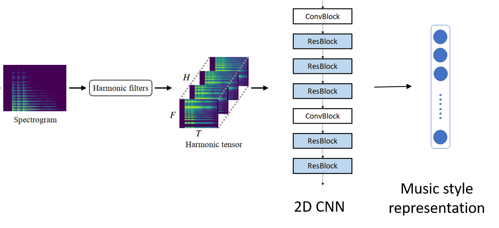
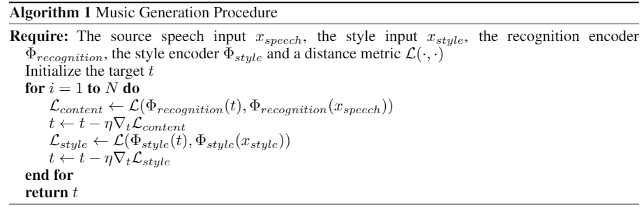
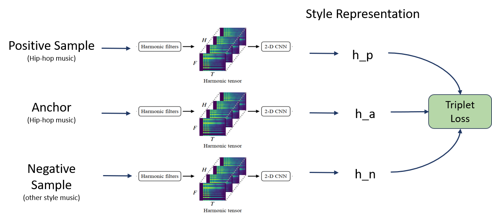

# Fake-Rapper-Helper
A Dual Convolutional Neural Network for Specific Style Music Generation from an Insipid Speech Clip


[1.Data Preparation](#prepare-data)

[2.Style Encoder Branch](#style-encoder)

[3.Content Preserver Branch](#content-encoder)

[4. Overall Music Generating Framework](#music-generation)

[5.Codes](#code)


### Prepare Data
- The content encoder is pretrained on LibriSpeech dataset which is often used in ASR. It contains 1000 hours of English speech with a unversal sampling rate of 16k.
- For training  style the style encoder, we adopt the MagnaTagATune (MATA) dataser, which is created from online music pieces and labels. We use a subset of 6000 music pieces for training. To ensure music diversity, the data is first grouped into 10 broad music genres including Hip-pop and a subset of each category is selected.  We also examine the quality of the data and further include more Hip-hop music samples. Each music piece is clipped into 10-second segments before further analysis.


### Style Encoder
- The aim of our style transformer is to learn a special encoding of the input audio. And this encoding should act as a latent feature representation of the music style (especially for the hip-hop style) of the input. 

- Domain knowledge can be very helpful for extracting acoustic features from music. To facilitate more efficient representation learning, the learnable harmonic filters from[1] are adopted in this work. The output of the harmonic filters is a harmonic tensor with a size of H * F * T.  After computing the harmonic tensor, we treat the harmonics here as different channels and send them into a 2D CNN module. This enforces the convolutional filters to embed harmonic information with locality in time and frequency domain.

- To enhance the discriminant ability of the style encoder, we adopt the Siamese network framework to train our model. It is set up to take three examples: anchor, positive sample and negative sample. The anchor and the positive sample are both clips of hip-hop songs, and the negative sample should be a clip from a song with any styles other than hip-hop. The style representations of three input items will then be used for calculating triplet loss.




### Content Encoder
- To enforce an invariant quantity, the content of the speech, we design a recognition network which basically adopted from a pre-trained CNN encoder of an Automatic Speech Recognition end-to-end model. 
- The encoder takes the original speech spectrogram and the randomly initialized target spectrogram as inputs. It outputs the corresponding hidden states of the input signals.
- We then measure the Mean Square Error between the content representation vectors as the measure of the distance between the speech spectrogram and the desired spectrogram. We freeze the encoder network and the cosine similarity loss would be back-propagated to update the target spectrogram.


### Music Generation
The generation procedure is described below where the gradient descent updating is performed on the target output with respect to the content and style loss.





### Codes

- To train style encoder network: 

  ```python
  styleRepresentation/styleEncoderTraining.ipynb
  ```

- To visualize the results of different loss functions and hyper-parameters for style encoder:

  ```python
  styleRepresentation/embeddingPlot.ipynb
  ```

- To generate a music clip from the pretrained style encoder and content encoder:

  ```python
  train.ipynb
  ```

  